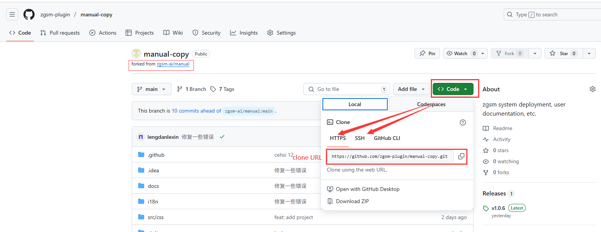
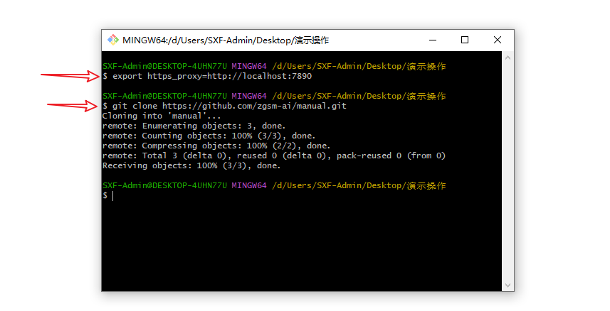
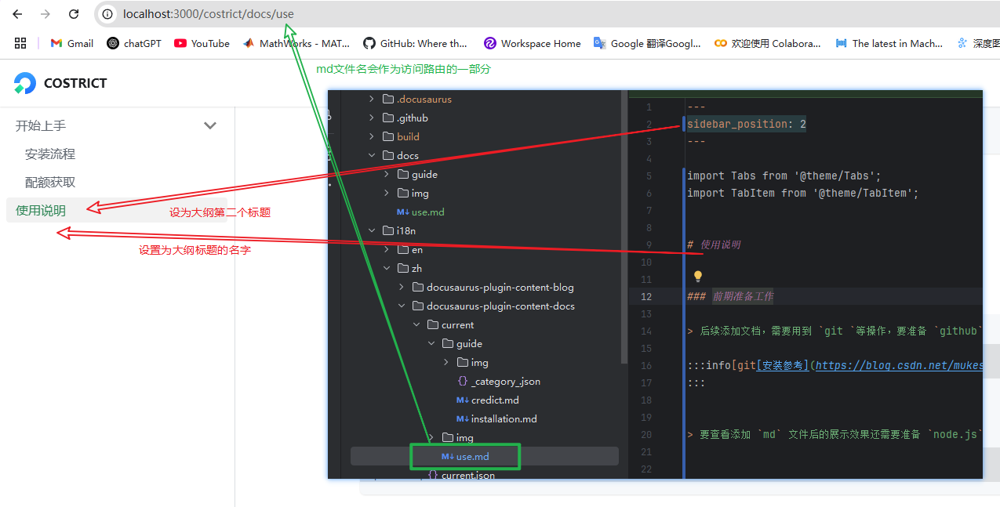

import Tabs from '@theme/Tabs';
import TabItem from '@theme/TabItem';


# 使用说明


### 前期准备工作

> 后续添加文档，需要用到 `git `等操作，要准备 `github` 账号 和 `git` 工具

[安装参考](https://blog.csdn.net/mukes/article/details/115693833)


> 要查看添加 `md` 文件后的展示效果还需要准备 `node.js` （本地测试完才可以提交代码）


[下载链接](https://nodejs.org/en/download)


## 文档仓库

### 克隆仓库

[文档仓库地址](https://github.com/zgsm-ai/manual)

1. 首先 `fork` 主仓库, 会在个人账户下创建一个与原始项目一模一样的仓库副本, 在副本仓库操作，可以避免错误操作等带来的影响


<br />

2. 在 `git bash` 中执行克隆命令

```commandline
git clone [URL]  # 例如 git clone https://github.com/zgsm-ai/manual.git
```


<details>
  <summary> 3. 查看 `fork` 仓库的 `URL`， 选择  `HTTPS / SSH` 复制</summary>



</details>

大部分情况下， 直接 `clone` 会因为网络问题 `clone` 失败， 即便挂了科学上网， 设置系统代理可能也不行

> 两种解决方法

1. 使用代理软件的 `tun` 模式， 这种就相当于生成了一个虚拟网卡， 即透明代理
2. 因为 `cmd` 这种没遵循系统代理设置， 我们可以通过环境变量强制指定其使用我们的代理

> `cmd` 和 `bash` 设置环境变量有区别, 参考：

<Tabs>
  <TabItem value="apple" label="git bash" default>
```commandline
export https_proxy=http://localhost:7890  # 7890 是clash的端口， verge应该是7897
export http_proxy=http://localhost:7890   # 这个加不加都行
```
  </TabItem>
  <TabItem value="orange" label="cmd">
```commandline
set https_proxy=http://localhost:7890  # 7890 是clash的端口， verge应该是7897
set http_proxy=http://localhost:7890   # 这个加不加都行
```
  </TabItem>
</Tabs>

> clone的总流程如下所示



4. 接下来 `cd` 到 克隆的项目下， 后续提交代码等操作即可在这里进行
```commandline
// highlight-next-line
cd manual
# SXF-Admin@DESKTOP-4UHN77U MINGW64 /d/Users/SXF-Admin/Desktop/演示操作/manual (main)
# cd 后应该可以看到当前位于 main 分支

// highlight-next-line
git checkout -b feature/your-branch  # 尽量不要在 main 或者 master 分支开发, 这里从 main 创建一个新的开发分支
# SXF-Admin@DESKTOP-4UHN77U MINGW64 /d/Users/SXF-Admin/Desktop/演示操作/manual (feature/add-md)
# 已经在你的个人分支上了
```

### 仓库结构

> 通过 `git` 克隆后, 可以看到项目结构，这里只列举了需要关注的部分

```js
manual-copy
├─docs
│  ├─guide
│  │  └─img
│  └─img
├─i18n
│  └─zh
│      ├─docusaurus-plugin-content-docs
│      │  └─current
│      │      ├─guide
│      │      │  └─img
│      │      └─img
```

`docs` 下的 `md` 文件对应于英文文档, 在 `i18n/zh/docusaurus-plugin-content-docs/current` 下的 `md` 文件 对应于中文文档

不同文档结构在使用时会有点差别，先划分下两种结构

> 多个文档位于同一个标签（目录）下 -> 分组式结构， 如下
```commandline
docs/
├── getting-started/
│   ├── installation.md
│   └── quota.md
```

> 每个文档对应一个标签 -> 扁平式结构， 如下
```commandline
docs/
├── getting-started.md
├── installation.md
├── quota.md
└── usage-guide.md
```


## 本地调试
:::info[在项目目录下执行命令， 安装开发所需的包]

```commandline
npm install
```
:::

### 开发模式
开发模式执行
```commandline
npm run start
```
本地修改会实时同步到前端页面上， 适合调试， 但是存在个问题， 没法测试中英文文档切换和搜索等功能， 因此需要用到生产模式


### 生产模式
依次执行
```commandline
npm run build
npm run serve
```
这种缺点是没法实时看到修改的内容

## 编写文档
文档和所在目录的命名不能存在*空格*，可以用`‘-’`

### 添加扁平式结构文档

- 把准备好的英文版本的 `md` 文件直接放在 `docs` 目录下, 图片等资源可以放在同级的img文件夹中
- 同样在 `current` 也准备一份， 内容翻译为中文，最终结构如下：

```js
manual-copy
├─docs
// highlight-start
│  └─img
│  └─your.md
│  └─ ...
// highlight-end
├─i18n
│  └─zh
│      ├─docusaurus-plugin-content-docs
│      │  └─current
// highlight-start
│      │      └─img
│      │      └─your.md
│      │      └─ ..
// highlight-end
```

编写md文件需要加入下面的内容
```commandline
---
sidebar_position: 3          # 该参数规定了当前文档在大纲中的位置， 需要放在md文件的开头
---

第一个 #（即一级标题）会作为大纲标题
```

<details>
  <summary> 实际效果对照 </summary>



</details>


### 添加分组式结构文档

首先把md文件按照下列方式组织起来
```js
manual-copy
├─docs
// highlight-start
│  ├─guide
│  │  └─img
│  │  └─_category_.json
│  │  └─mdfile1.md
│  │  └─mdfile2.md
│  │  └─ ...
// highlight-end
├─i18n
│  └─zh
│      ├─docusaurus-plugin-content-docs
│      │  └─current
// highlight-start
│      │      ├─guide
│      │      │  └─img
│      │      │  └─_category_.json
│      │      │  └─mdfile1.md
│      │      │  └─mdfile2.md
│      │      │  └─ ...
// highlight-end
```


相比扁平式结构文档，需要增加 `_category_.json` 文件


```js
# _category_.json
{
  "label": "Getting Started",   # 大纲标题 （不过在这里不起作用，需要继续向下看）
  "position": 1,                # 当前目录大纲位置
  "link": {
    "title": "Getting Started", # 大纲导航页标题 （不过在这里不起作用，需要继续向下看）
    "type": "generated-index"   # 自动生成大纲标题
  }
}
```

涉及到中英文翻译，需要额外做一点操作， 这个是 `docusaurus` 本身存在的一点问题[可以看这里的讨论](https://github.com/facebook/docusaurus/issues/8996)

> 执行

```js
npm run docusaurus -- write-translations
```

查看 `i18n/zh/docusaurus-plugin-content-docs/current.json`, 将其中的英文翻译为中文


## 提交代码


:::warning[通过生产模式测试才可以提交pr]
:::


```commandline
git add .   # 准备处理全部改动

git commit -m "docs: add contributing guide"  # 提交到工作区

# 如果主线有改动是本地没有的
# git pull --rebase origin main  # 不要直接 pull 会多一次合并提交

git push -u origin feature/add-md:feature/add-md)  # 这样会在github个人仓库新建一个feature/add-md分支并提交
```
[其他 git 使用介绍参考](https://github.com/zgsm-ai/costrict/blob/main/assets/docs/devel/zh-CN/fork.md)

完成上述操作后， 准备提交pr


> 首先检查下提交的内容和本地提交的是不是一致的， 点击后查看每个文件的改动


确认无误后， 点击：


确认下目标分支和提交分支是不是正确的， 没问题后， 点击create pull request, 遵守提交准则，即完成


<br/>
合并到主线后会自动触发服务更新，可以在主仓库的 `Actions` 下查看